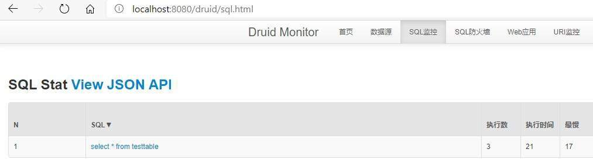
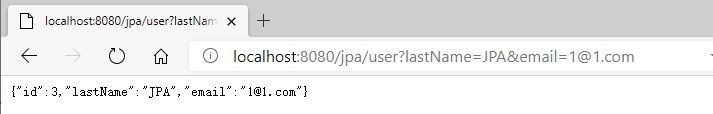
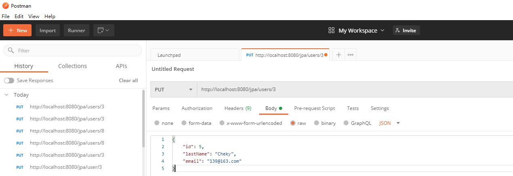
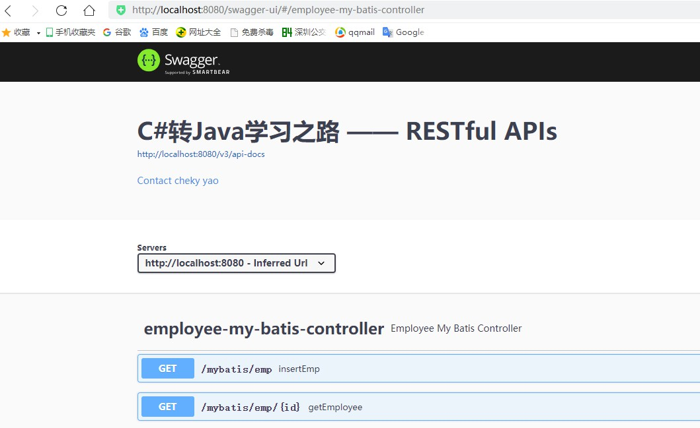

# C#转Java学习之路 （Start 2020-11）

——目标：快速上手，并应用在API 和 EDI 开发

有不对和推荐及建议，欢迎提出，共同学习提升嘎！


## 1.安装

所有工具安装包 [百度网盘](https://pan.baidu.com/s/1HVI0gBrHTzBiBdInYqFd-g) 提取码: 8dud

1. 安装 [11 JDK](https://www.oracle.com/java/technologies/javase-downloads.html#JDK11) | [Doc](https://docs.oracle.com/en/java/javase/11/docs/api/index.html) | [OpenJDK 11 (推荐)](https://www.azul.com/downloads/zulu-community/?version=java-11-lts&os=windows&architecture=x86-64-bit&package=jdk&show-old-builds=true)
2. 安装 [IntelliJ IDEA Community Edition](https://www.jetbrains.com/zh-cn/idea/download/download-thanks.html?platform=windows&code=IIC) 
   - 安装 插件 [Spring Assistant](https://blog.csdn.net/u012860950/article/details/76146072)
   - 安装 插件 详见 4.5. Lombok
   - 安装 插件 详见 4.6. Coding Style
3. 安装 MySql [Installer Version (推荐 下载最新但安装选择5.7)](https://dev.mysql.com/downloads/windows/installer/) | [Installer 教程](https://www.runoob.com/w3cnote/windows10-mysql-installer.html)；也可以单独安装 [Workbench Version](https://dev.mysql.com/downloads/file/?id=498730) 
4. 环境 [Maven](https://maven.apache.org/) IDEA本身有自动捆绑的


## 2.简介

J2SE 标准版

J2EE 企业版

J2ME 微型版

JDK 开发工具 （JDK 自带 JRE 和 JVM）（命令Javac）

JRE 运行环境 （JRE 自带 JVM）（命令 Java）

JVM 运行环境  (与操作系统交互)


## 3.架构与框架

学习思路：看官方文档 和 源码

### 3.1.架构

 [Springboot](https://spring.io/quickstart) （[Doc](https://spring.io/projects/spring-boot#learn) | [Doc (推荐)](https://docs.spring.io/spring-boot/docs/current/reference/html/spring-boot-features.html#boot-features-external-config)| [Vedio1](https://www.bilibili.com/video/BV1DC4y1H7Xk?p=3) | [Vedio2 **(推荐)**](https://www.bilibili.com/video/BV1Et411Y7tQ?p=4)）: 用来简化 Spring的配置

#### 3.1.1.配置

1. yaml语法；
2. 加载配置 由高覆盖低，所有的配置会形成互补配置；
3. 日志 采用 slf4j [Reference](https://docs.spring.io/spring-boot/docs/current/reference/html/spring-boot-features.html#boot-features-logging)

### 3.2.框架

#### 3.2.1. Dubbo

[官网-入口](http://dubbo.apache.org/zh-cn/) | [Vedio](https://www.bilibili.com/video/BV1n4411x7tB?from=search&seid=6165747634317706089)

简述：分布式服务框架(RPC) 。

- **Nacos**

  - [官网-入口](https://nacos.io/zh-cn/docs/quick-start.html)

  - 简述阿里力推的新一代Dubbo 注册中心

  - 按照官网安装并启动后，即可登陆注册中心http://127.0.0.1:8848/nacos，账号密码均为 nacos

    启动服务器：startup.cmd -m standalone

    关闭服务器：shutdown.cmd

- **Gateway**

  Dubbo想要个网关怎么办？[试试整合Spring Cloud Gateway](https://developer.aliyun.com/article/766073)

#### 3.2.2. ORM 之 MyBatis

[官网-入门](https://mybatis.org/mybatis-3/zh/getting-started.html) | [官方-GitHub](https://github.com/mybatis/mybatis-3) | [Vedio](https://www.bilibili.com/video/BV185411s7Ry)


#### 3.2.3. ORM 之 JPA 

[Vedio 1 (推荐)](https://www.bilibili.com/video/BV1hE411s72B?from=search&seid=15178363451123815741) | [Vedio 2](https://www.bilibili.com/video/BV1vW411M7zp?from=search&seid=4569420490784919925) | [教程](https://www.w3cschool.cn/java/jpa-entitymanager.html) | [百科](https://baike.baidu.com/item/JPA/5660672?fr=aladdin) | [关系](https://my.oschina.net/u/3080373/blog/1828589)

简述：一种规范。简化应用开发工作；希望整合ORM技术，实现天下归一。

路线：SpringDataJpa >> JPA规范的API >> hibernate(实现了JPA) >> JDBC >> DB

JPA-SPEC [教程](https://www.w3cschool.cn/jpaspec/)


#### 3.2.4. JDBC & DB:

- Druid [官网-入口](https://druid.apache.org/docs/latest/design/) | [Doc](https://druid.apache.org/docs/latest/design/) | [官方-GitHub](https://github.com/alibaba/druid/) | [官方-WIKI](https://github.com/alibaba/druid/wiki/%E5%B8%B8%E8%A7%81%E9%97%AE%E9%A2%98)

- MySQL [教程](https://www.runoob.com/mysql/mysql-install.html) | [Vedio 1 (推荐)](https://www.bilibili.com/video/BV1pf4y1v7mK?p=15)

  DQL, DML, DDL, DCL 的[概念和区别](https://www.cnblogs.com/fan-yuan/p/7879353.html)

- dbeaver [官网-入口](https://dbeaver.io/) | [Vedio](https://www.bilibili.com/video/BV1Jv411678J?t=890)

- SQL样式指南 [参考](https://www.sqlstyle.guide/zh/)


#### 3.2.5. 基础概念

- [Bean](https://baike.baidu.com/item/Bean/3792612?fr=aladdin): 一种规范，表达实体和信息的规范，便于封装重用。 [Reference](https://www.zhihu.com/question/19773379)

- [DAO](https://baike.baidu.com/item/DAO/2900358?fr=aladdin): 通俗来讲，就是将数据库操作都封装起来。[Reference](https://www.runoob.com/note/27029)

- IOC: 简单来说就是把复杂系统分解成相互合作的对象，这些对象类通过封装以后，内部实现对外部是透明的，从而降低了解决问题的复杂度，而且可以灵活地被重用和扩展。[Reference](https://blog.csdn.net/ivan820819/article/details/79744797)

- [AOP](https://baike.baidu.com/item/AOP/1332219?fr=aladdin): 通过[预编译](https://baike.baidu.com/item/预编译/3191547)方式和运行期间动态代理实现程序功能的统一维护的一种技术。[Reference](https://www.zhihu.com/question/24863332)

- [ZooKeeper](https://baike.baidu.com/item/zookeeper/4836397?fr=aladdin): 一个[分布式](https://baike.baidu.com/item/分布式/19276232)的，开放源码的[分布式应用程序](https://baike.baidu.com/item/分布式应用程序/9854429)协调服务，是[Google](https://baike.baidu.com/item/Google)的Chubby一个[开源](https://baike.baidu.com/item/开源/246339)的实现，是Hadoop和[Hbase](https://baike.baidu.com/item/Hbase/7670213)的重要组件。[官网-入口](https://zookeeper.apache.org/) 

- [Netty](https://baike.baidu.com/item/Netty/10061624?fr=aladdin): 一个基于NIO的客户、服务器端的编程框架。相当于简化和流线化了网络应用的编程开发过程，例如：基于TCP和UDP的socket服务开发。[Reference](https://www.jianshu.com/p/b9f3f6a16911)

- [RPC](https://baike.baidu.com/item/%E8%BF%9C%E7%A8%8B%E8%BF%87%E7%A8%8B%E8%B0%83%E7%94%A8/7854346?fromtitle=RPC&fromid=609861&fr=aladdin): 一种技术思想，像调用本地的函数一样去调远程函数。 [Reference](https://www.zhihu.com/question/25536695)

- > META-INF: 相当于一个信息包，目录中的文件和目录获得Java 2平台的认可与解释，用来配置应用程序、扩展程序、类加载器和服务manifest.mf文件，在用jar打包时自动生成。[Reference](https://blog.csdn.net/qq_38449518/article/details/82414069)

- JSP（全称Java Server Pages）是由 Sun Microsystems 公司倡导和许多公司参与共同创建的一种使软件开发者可以响应客户端请求，而动态生成 HTML、XML 或其他格式文档的Web网页的技术标准。[Reference](https://www.runoob.com/jsp/jsp-tutorial.html)

- [Tomcat](https://baike.baidu.com/item/tomcat/255751?fr=aladdin) 服务器是一个免费的开放源代码的Web 应用服务器，属于轻量级应用[服务器](https://baike.baidu.com/item/服务器)，在中小型系统和并发访问用户不是很多的场合下被普遍使用，是开发和调试JSP 程序的首选。

- [Jetty](https://baike.baidu.com/item/jetty/370234?fr=aladdin) 是一个开源的servlet容器，它为基于Java的web容器，例如JSP和servlet提供运行环境。

- Jetty 相对 Tomcat 更轻量级，[区别](https://blog.csdn.net/swebin/article/details/93883268)

### 3.3. WebApi编码风格RESTful[CRUD](https://baike.baidu.com/item/crud/3606157?fr=aladdin)

[Vedio 1](https://www.bilibili.com/video/BV1Nt411b7m8?from=search&seid=1828525539571397242) | [Vedio 2 (推荐)](https://www.bilibili.com/video/BV1Zi4y1g75p?from=search&seid=13898736271447053760)

以操作员工Emp为例

|          | 普通CRUD(uri来区分操作)  | RESTfulCRUD       |
| -------- | ------------------------ | ----------------- |
| Create   | addEmp?xxx               | emp---POST        |
| Retrieve | getEmp                   | emp---Get         |
| Update   | updateEmp?id=xx1&col=xx2 | emp/{id}---PUT    |
| Delete   | deleteEmp?id=xxx         | emp/{id}---DELETE |

需要了解 [JsonAPI](http://jsonapi.org.cn/)


## 4.基础

### 4.1. 面向对象

特征：封装，继承，多态

OOA （Object-Oriented Analysis）>> OOD （Object-Oriented Design）>> OOP （Object-Oriented Programming）


### 4.2. IntelliJ IDEA 快捷键[^2]

**常用快捷键**

Ctrl+Alt+S 打开Settings，找到keymap，下拉选项选为Visual studio，这样绝大多数VS快捷键就可以使用了

| 其他常用快捷键                                               | 描述                                            |
| ------------------------------------------------------------ | ----------------------------------------------- |
| <kbd>Alt</kbd>+<kbd>Insert</kbd>                             | 自动生成代码（eg: AutoGenerateGetterAndSetter） |
| <kbd>Ctrl</kbd>+<kbd>Alt</kbd>+<kbd>/</kbd>                  | 行注释                                          |
| <kbd>Ctrl</kbd>+<kbd>Shift</kbd>+<kbd>/</kbd>                | 块注释                                          |
| <kbd>Shift</kbd>+<kbd>Shift</kbd> 或<kbd> Ctrl</kbd>+<kbd>T</kbd> | 全局搜索                                        |
| <kbd>Ctrl</kbd>+<kbd>Alt</kbd>+<kbd>F</kbd>                  | 显示类中所有的成员（如方法，变量）              |
| <kbd>Ctrl</kbd>+<kbd>Shift</kbd>+<kbd>H</kbd>                | 全局替换                                        |


**有很多的快捷代码块模板**

也可以在settings自定义 live Templates

| 代码块的简写 | 实际生成代码                             |
| ------------ | ---------------------------------------- |
| psvm         | public static void main(String[] args){} |
| sout         | System.out.println();                    |
| fori         | for(int i = 0; i < ; i++){}              |
| list.for     | for(Object o : list){}                   |
| ifn          | if( == null){}                           |
| prsf         | private static final                     |


### 4.3. Java 语法[^1]

[Coding Standard (推荐)](https://github.com/alibaba/p3c/blob/master/Java%E5%BC%80%E5%8F%91%E6%89%8B%E5%86%8C%EF%BC%88%E5%B5%A9%E5%B1%B1%E7%89%88%EF%BC%89.pdf)

静态代码块： 类加载的时候会运行。可以应用在 记录类加载的日志信息

实例代码块： 类在实例化的时候会运行，执行顺序在构造方法之前。

package 命名： 一般采用 公司域名倒序 + 项目名 + 模块名 + 功能名

Exception: 分为 运行时异常（概率小）和 编译时异常（概率大，需要提前代码处理）


**关键字转换[Reference](https://www.tangiblesoftwaresolutions.com/java-and-csharp-equivalents.html)**

| Java                                 | C#             |
| ------------------------------------ | -------------- |
| instanceof                           | is             |
| super                                | base           |
| final                                | seal, readonly |
| static final                         | const          |
| default                              | internal       |
| extends                              | :              |
| implements                           | :              |
| import                               | using          |
| finalize()                           | Dispose()      |
| Date                                 | DateTime       |
| transient                            | NonSerialized  |
| synchronized                         | lock           |
| ...                                  | params         |
| @interface @Target @Retention 元注解 | Attribute      |
| @Deprecated                          | Obsolete       |
| <?extendsT> 或 <?superT>             | T where T: ?   |


Integer: [-128, 127] 静态类 自动加载，即 自动装箱 不会再 New， 而超过此范围的会New

```Java
//Example
Integer a = 128;
Integer b = 128;
var c = a == b; //false
Integer x = 127;
Integer y = 127;
var z = x == y; //true
```


**常用Collection**

| 集合类     | 描述                                                         |
| ---------- | ------------------------------------------------------------ |
| ArraryList | 有序可重复；数据结构：数组；多线程不安全； C#的List          |
| LinkedList | 有序；数据结构：双向链表                                     |
| Vector     | 与ArraryList类似，但多线程安全；注意：因效率低，现在很少用了 |
| HashSet    | 无序不可重复；数据结构：哈希表                               |
| TreeSet    | 自动按大小排序；数据结构：二叉树                             |

工具类： Collections


**常用Map**

| 集合类  | 描述                                                         |
| ------- | ------------------------------------------------------------ |
| HashMap | 无序不可重复；数据结构：数组和单向链表与红黑树的结合体；对象要重写方法hashCode和equals；C#的 Dictionary |
| TreeMap | 自动按大小排序；数据结构：二叉树                             |


**常用IO**

| 类型                         | 类                   | 描述                     |
| ---------------------------- | -------------------- | ------------------------ |
| 文件专属                     | FileInputStream      |                          |
|                              | FileOutputStream     |                          |
|                              | FileReader           |                          |
|                              | FileWriter           |                          |
| 转换流（字节流转换为字符流） | InputStreamReader    |                          |
|                              | OutputStreamReader   |                          |
| 缓冲流                       | BufferedReader       |                          |
|                              | BufferedWriter       |                          |
|                              | BufferedInputStream  |                          |
|                              | BufferedOutputStream |                          |
| 数据流                       | DataInputStream      | 一定要按输出的顺序来输入 |
|                              | DataOutputStream     |                          |
| 标准输出流                   | PrintWriter          |                          |
|                              | PrintStream          |                          |
| 对象专属流                   | ObjectInputStream    |                          |
|                              | ObjectOutputStream   |                          |


**多线程**

- Java 采用的调度模型 是 抢占式调度模型；

- 变量的线程安全：实例变量（堆） 与 静态变量（方法区） 需要 注意， 而 栈里的局部变量 不会出现线程不安全的情况。


**反射**

* Class
* Constructor
* Field
* Method


### 4.4. Git

Git: [官网-入口](https://git-scm.com/) | [教程](https://www.runoob.com/git/git-remote-repo.html) | [Vedio](https://www.bilibili.com/video/BV1FE411P7B3?from=search&seid=15397190439228285818) | [Git flow](https://gitbook.tw/chapters/gitflow/why-need-git-flow.html)

SourceTree: [官网入口](https://www.sourcetreeapp.com/)

平台: GitHub, Gitee

How to pull requests in GitHub?  [reference](https://www.bilibili.com/video/BV1mt411B7wZ?from=search&seid=4591624557982506335)

**常用指令**

| 指令                       | 描述                       |
| -------------------------- | -------------------------- |
| git config --global --list | 全局配置(必配，类似ID)     |
| git config --system --list | 系统配置                   |
| git init                   | 初始化本地仓库             |
| git clone [url]            | 克隆远程仓                 |
| git status                 |                            |
| git add .                  | 添加所有文件到暂存区       |
| git commit -m ["message"]  | 提交暂存区中的内容到本地仓 |

**常用分支命令：用于多人协作**

| 指令                                  | 描述                               |
| ------------------------------------- | ---------------------------------- |
| git branch                            | 列出所有本地分支                   |
| git branch -r                         | 列出所有远程分支                   |
| git branch [branch-name]              | 新建一个分支，但依然停留在当前分支 |
| git checkout -b [branch]              | 新建一个分支，并切换到该分支       |
| git merge [branch]                    | 合并指定分支到当前分支             |
| git branch -d [branch-name]           | 删除分支                           |
| git push origin -delete [branch-name] | 删除远程分支                       |
| git branch -dr [remote/branch]        | 删除远程分支                       |

### 4.5. Lombok

[官网-入口](https://projectlombok.org/) | [Vedio](https://www.bilibili.com/video/BV1qJ411G7Dv?from=search&seid=17190820160849777380) | [Reference](https://zhuanlan.zhihu.com/p/32779910)

简述：透过注解，实现不用再编写冗长代码；如@Setter @Getter，从而提升开发效率和代码简洁。

- IDEA 需安装插件 Lombok

- Project 需引入相应maven包

  ```xml
  <dependency>
      <groupId>org.projectlombok</groupId>
      <artifactId>lombok</artifactId>
      <version>1.18.12</version>
      <scope>provided</scope>
  </dependency>
  ```

### 4.6. Coding Style

安装 [阿里编码规约插件](https://jingyan.baidu.com/article/75ab0bcb75beced6864db2b1.html)

### 4.7. Maven

[官网-入口](https://maven.apache.org/) | [Repositories](https://mvnrepository.com/) | [Vedio 1](https://www.bilibili.com/video/BV124411H7Fj?p=3) | [Vedio 2](https://www.bilibili.com/video/BV1dp4y1Q7Hf?from=search&seid=14638114435887962271)| [教程](https://www.runoob.com/maven/maven-repositories.html) 

简介：项目管理工具，如 管理jar包，集成测试，一键打包等。

Repositories： 可以在上面找到 如 Druid 的Maven包。


- **nexus**是一个强大的maven仓库管理器,它极大的简化了本地内部仓库的维护和外部仓库的访问.[Reference](https://blog.csdn.net/ytm15732625529/article/details/81159425)


## 5.实战

### 5.1. 学习Templates

https://github.com/ChekyYao/Java


### 5.2. 综合实践

简介：Springboot + SpringMVC + WebApi(RESTful) + SpringData(JPA) + MyBatis + Druid + JDBC + MySQL + log(slf4j)

https://github.com/ChekyYao/SpringBootDemo/tree/main/com-cheky-springboot-demo

1. 配置JDBC


2. 配置Druid



3. 配置MyBatis


4. 配置JPA



### 5.3. 测试工具

- Postman

  

- Swagger

  [官网-入口](https://swagger.io/) | [Reference](https://www.mdeditor.tw/pl/pNUO/zh-cn)

  代码详见: SwaggerConfig.java

  依赖
  
  ```xml
  <dependency>
      <groupId>io.springfox</groupId>
      <artifactId>springfox-boot-starter</artifactId>
      <version>3.0.0</version>
</dependency>
  ```
  
  
  

### 5.4. 综合实践 升级为Dubbo

简介：把5.2的项目升级为dubbo框架

https://github.com/ChekyYao/SpringBootDemo/tree/main/com-cheky-dubbo-demo


### 5.5. 扩展

Groovy：[官网-入口](http://www.groovy-lang.org/) | [Doc](http://www.groovy-lang.org/documentation.html) | [教程](https://www.w3cschool.cn/groovy/groovy_overview.html) | [简书](https://www.jianshu.com/p/e8dec95c4326)

Jackson：[使用详解 重点看七 Jackson注解](https://juejin.cn/post/6844904166809157639#heading-1) | [GitHub](https://github.com/FasterXML/jackson)

Liquibase：[官网-入口](https://docs.liquibase.com/home.html) | [Reference](https://blog.csdn.net/qq_39508627/article/details/89883549) | [Reference2](https://juejin.cn/post/6844903808078708743)

XXL-JOB：[GitHub](https://github.com/xuxueli/xxl-job) | [Doc](https://www.xuxueli.com/xxl-job/#《分布式任务调度平台XXL-JOB》) | [Vedio](https://www.bilibili.com/video/BV1oC4y147iG) 

Querydsl：[官网入口](http://www.querydsl.com/) | [GitHub](https://github.com/querydsl/querydsl)

easy-captcha：[GitHub](https://github.com/whvcse/EasyCaptcha) 图形验证码

thymeleaf：用来开发Web和独立环境项目的服务器端的Java模版引擎 [官网](https://www.thymeleaf.org/) | [入门](https://www.jianshu.com/p/ac8201031334)

visualvm：[GitHub](https://github.com/oracle/visualvm/releases) | [配置及其安装](https://blog.csdn.net/qq_28509737/article/details/106541693) | [Vedio](https://www.bilibili.com/video/BV1N741127Wt)

Swagger：[官网-入口](https://swagger.io/) | [Vedio](https://www.bilibili.com/video/BV1Y441197Lw) | [入门 1](https://www.mdeditor.tw/pl/pNUO/zh-cn) | [入门 2](https://blog.csdn.net/weixin_39396822/article/details/84631211) 

Swagger Open API：[官网-Spec](https://swagger.io/docs/specification/about/) | [Open API 参考](https://app.swaggerhub.com/apis-docs/ChekyYao/Demo/1.0.1-oas3) | [Open API map](https://openapi-map.apihandyman.io/)

监控

- micrometer：指标采集；  [官网](https://micrometer.io/) | [Docs](https://micrometer.io/docs) | [入门 1](https://www.cnblogs.com/cjsblog/p/11556029.html) | [入门 2](https://blog.csdn.net/weixin_38569499/article/details/85344317) | [Vedio 1](https://www.bilibili.com/video/BV1Na4y1v7Wz) | [Vedio 2](https://www.bilibili.com/video/BV1sC4y1873R?p=13)
- spring boot actuators: 指标获取并发布；
- prometheus：指标存储； [官网](https://prometheus.io/download/)
- grafana： 指标查询展示； [官网](https://grafana.com/grafana/download?platform=windows) | [插件指令](https://www.jianshu.com/p/0d82c7ccc85a?from=groupmessage&isappinstalled=0)| [Reference](https://blog.csdn.net/weixin_44606217/article/details/96481191) 
- JMeter: 压测工具；[官网](https://jmeter.apache.org/) | [Vedio](https://www.bilibili.com/video/BV1ny4y1q7KA)

org.apache.poi poi-ooxml：处理Excel [官网](https://poi.apache.org/index.html) | [官网 Docs](https://poi.apache.org/apidocs/index.html) | [入门](https://www.cnblogs.com/pomelo-lemon/p/11395416.html)

org.apache.tika：Tika 是一个内容抽取的工具集合 (a toolkit for text extracting) 。它集成了 POI 和 Pdfbox，并且为文本抽取工作提供了一个统一的界面。其次，Tika 也提供了便利的扩展 API，用来丰富其对第三方文件格式的支持。[官网](https://tika.apache.org/) | [入门 1](https://blog.csdn.net/oMaoYanEr/article/details/105011172) | [入门 2](https://blog.csdn.net/chengyuqiang/article/details/85295902)

net.bytebuddy：一个可以在运行时动态生成java class的类库。 [入门](https://zhuanlan.zhihu.com/p/151843984)

io.jsonwebtoken jjwt：JJWT是一个提供端到端的JWT创建和验证的Java库。 [官网](https://jwt.io/) | [入门 1](https://www.cnblogs.com/cndarren/p/11518443.html) | [入门 2](https://www.cnblogs.com/loveer/p/11429111.html)

jodd

- json：[官网](https://json.jodd.org/)
- http：[官网](https://http.jodd.org/using-the-client)
- bean：[官网](https://util.jodd.org/beanutil/beanutil) | [入门](https://www.it610.com/article/1305800703767252992.htm)

Xml

- xmlunit：便捷的校验XML。 [官网](https://www.xmlunit.org/) | [Reference 1](https://zhk.me/618.html) | [Reference 2](https://blog.csdn.net/cuxiong8996/article/details/107155432/) 


## **参考文献 Reference:**

[^1]:  [Java零基础教程视频](https://www.bilibili.com/video/BV1Rx411876f?p=834) 与 [Java教程](https://www.runoob.com/java/java-collections.html)
[^2]: [IntelliJ IDEA 入门](https://www.bilibili.com/video/BV1DE411r7r1?from=search&seid=5422164101846745456) 与  [IDEA从零基础到专业 **(推荐)**](https://www.bilibili.com/video/BV157411m7VL?p=5)
[^3]: [IDEA Plugins](https://plugins.jetbrains.com/)
[^4]: [WebJars](https://www.webjars.org/)
[^5]: [License](https://blog.csdn.net/u012088909/article/details/106034587)
[^6]: UML：统一建模语言 [百科](https://baike.baidu.com/item/%E7%BB%9F%E4%B8%80%E5%BB%BA%E6%A8%A1%E8%AF%AD%E8%A8%80/3160571?fromtitle=UML&fromid=446747&fr=aladdin) | [Vedio 1](https://www.bilibili.com/video/BV1P741127u7?from=search&seid=7452914625849082333)


## Q & A

1. 无 Spring Initialzr

   安装插件 [Spring Assistant](https://blog.csdn.net/u012860950/article/details/76146072)

   

2. 快速配置快捷键与VS相同

   Settings(Ctrl+Shift+S) >> Keymap >> choose 'Visual Studio'

   

3. 关闭端口号 对于的进程

   [[Reference](https://blog.csdn.net/zhouky1993/article/details/103976320)]

   cmd : 

   netstat -ano | findstr 端口号

   taskkill -PID 进程号 -F
   
   
   
4. IDEA 社区版不支持 Diagrams

   

5. 解决maven 在intellij IDEA 下载依赖包速度慢的问题

   尝试改为Alibaba仓，但速度无明显提升。[[Reference](https://www.jianshu.com/p/63a593700ebc)]
   
   
   
6. 配置 Java_Home 

   Java_Home
   C:\Program Files\Zulu\zulu-11\
   
   
   
7. 配置 mysql 环境 path

   C:\Program Files\MySQL\MySQL Server 8.0\bin


---------------

if you have any question, please contact me.

**Author: Cheuk Yao**

**Date: 2020-11**

**EXP Date: 2020-12-31**

**e-Mail: 13925568211@163.com**